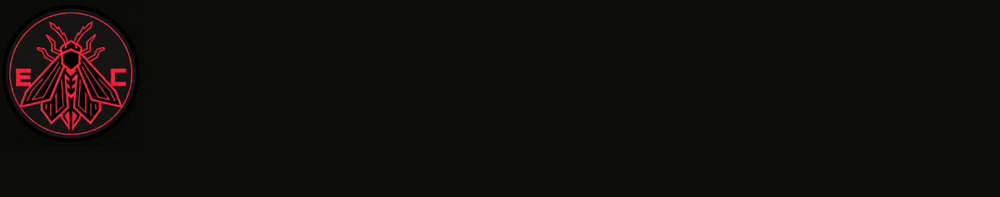

<!-- 🔥 Banner principal -->

# 🔴⚫ Projetos de Automação e OCR

Me chamo **Ingrid**, estou aprendendo **automação e análise de sistemas**.  
Aqui você encontra meus projetos, experimentos e aprendizados — sempre com um toque de curiosidade e muito café.

---

## 🚀 Tecnologias & Linguagens

  
  
  
  

---

## ✨ Projetos

| Projeto | Tecnologias | Descrição |
|---------|------------|-----------|
| **Cuidar+**   | Python, Flask, Firebase | Automação de dados acadêmicos com dashboard web. |

---

## 💻 Perguntas & Respostas

**🧠 Qual linguagem você acha mais divertida de programar?**  
Python é simples e direta.  

**⚙️ Já tentou automatizar alguma tarefa chata? Como foi?**  
Ainda não, mas pretendo escolher algo bem irritante só pra transformar em código.  

**🎨 Prefere front-end ou back-end?**  
Back-end. Designer não é meu dom.  

---

**💬 Python, C# ou JavaScript: qual escolher primeiro?**  
C#, sem dúvida.  

**🧩 Editor/IDE favorito:**  
Git integrado ao VS Code.  

**📚 Alguma biblioteca que mudou sua forma de programar?**  
Ainda nenhuma, mas o futuro promete.  

---

**☕ Café ou chá durante coding sessions?**  
Os dois, alternando entre bug e inspiração.  

**😎 GIFs ou memes no README?**  
Memes. Sempre.  

**🤯 Linguagem que você não entende até hoje?**  
Todas. (Mas uma hora eu pego o jeito.)  

---

## 🌱 Em Aprendizado
- Redes e bancos de dados   
- Criação de apps completos com backend e frontend integrados  
- Automação de pipelines CI/CD

---

## 📈 Estatísticas

  
  

---

## 🤝 Colaboração
Procurando pessoas **experientes em C# ou Python** para aprender, trocar ideias e crescer juntas em automação e OCR.

---

## 📫 Contato

  
  

---

💬 **Curiosidade:** minhas linguagens favoritas são **C# e Python**, mas também tenho experiência com **JavaScript**.
